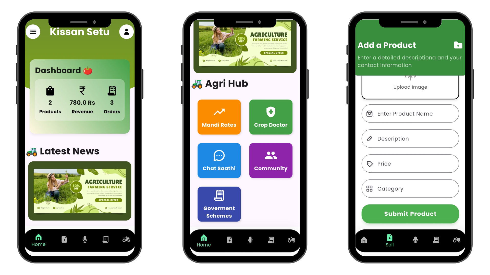
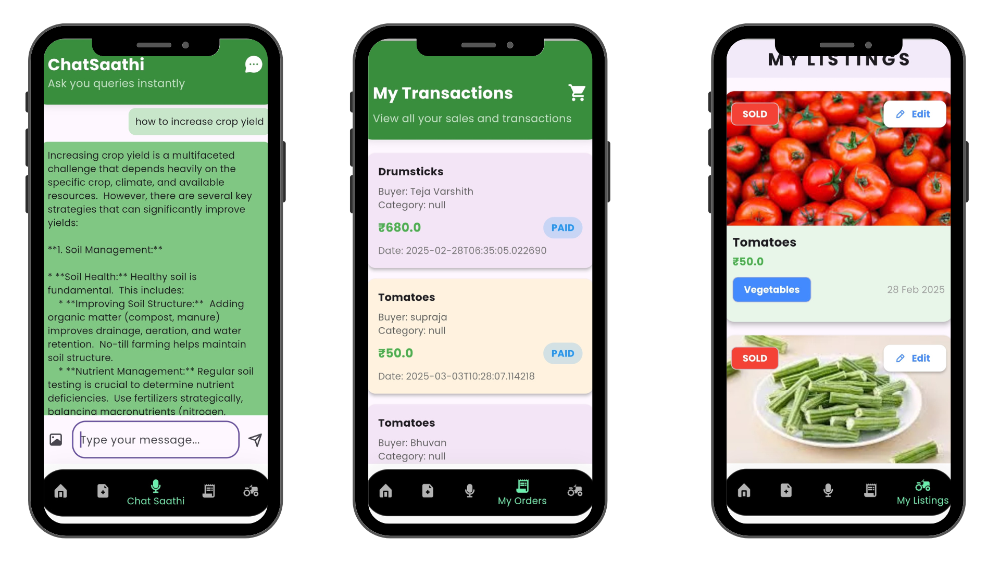
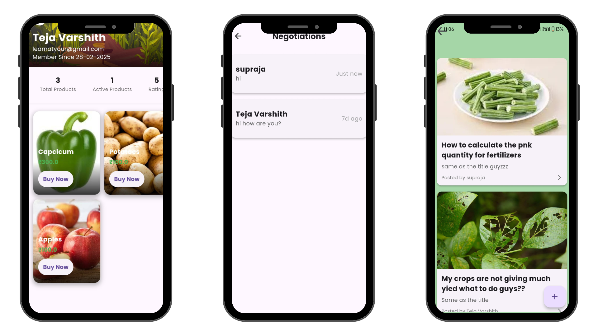
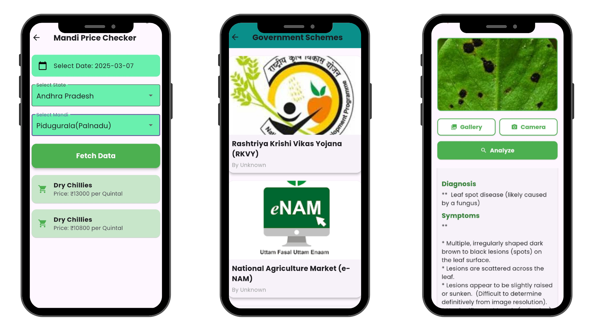
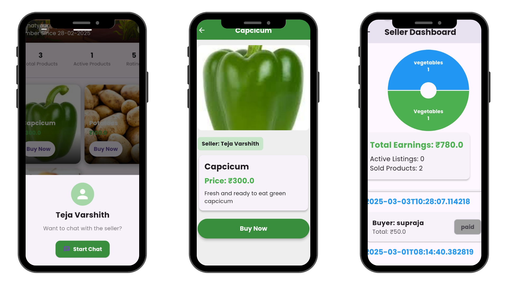

# 🚜 Kissan Setu 🌾

A Flutter app designed to connect farmers and buyers while integrating useful features to help farmers sell their produce more efficiently by removing middlemen.

---

## 🔥 Key Features

- 🔹 **Role-based access** – Farmers and buyers see different screens tailored to their needs
- 🔹 **Marketplace** – Farmers can upload products, buyers can purchase directly
- 🔹 **Chat System** – Smooth communication between buyers & sellers
- 🔹 **Live Mandi Prices** – Real-time market rates at a glance
- 🔹 **AI Crop Disease Detection** – Farmers can upload crop images for diagnosis
- 🔹 **Community Forum** – A space for farmers to discuss and share insights
- 🔹 **Farmer Profiles** – Ratings, product listings, and credibility
- 🔹 **Govt Schemes Info** – Easy access to relevant government schemes

---

## 🛠️ Tech Stack

- 🚀 **Frontend:** Flutter (Dart) for a smooth, cross-platform UI
- 🚀 **Authentication:** Firebase Authentication
- 🚀 **Database:** Firestore + Supabase (Hybrid approach for performance)
- 🚀 **Realtime Features:** Firestore for live chat & marketplace updates
- 🚀 **Crop Diagnosis:** Google Gemini API for crop disease detection

---







---

## 📑 Installation

To set up the project locally:

```bash
git clone https://github.com/your-username/kissan-setu.git
cd kissan-setu
flutter pub get
flutter run
